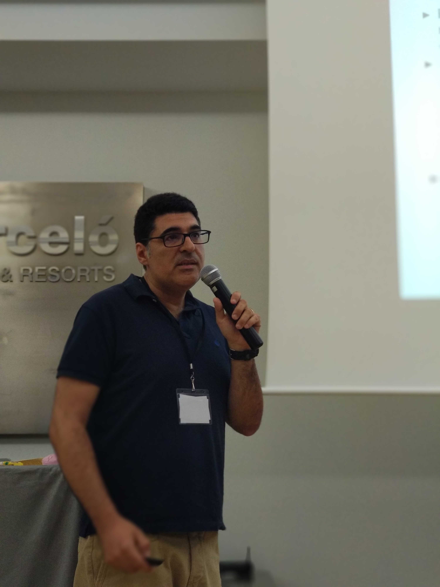
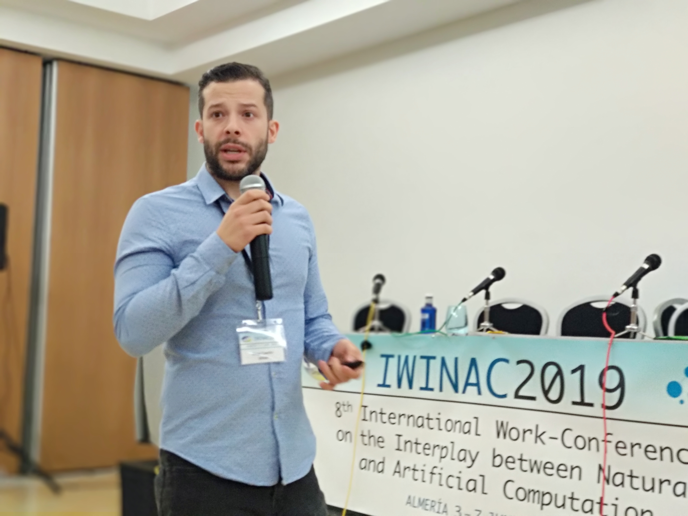
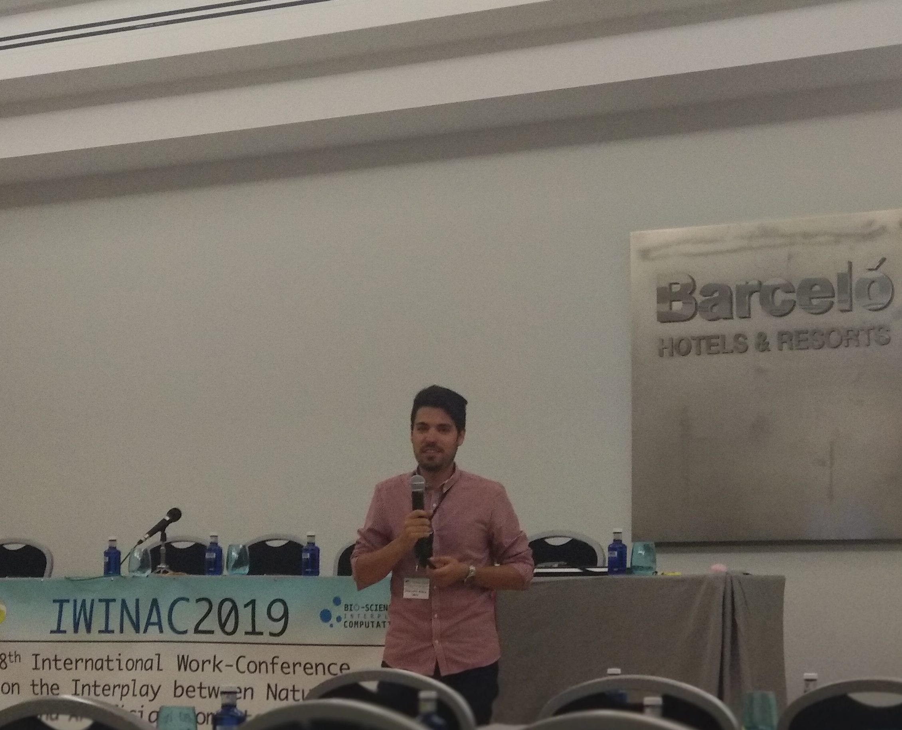
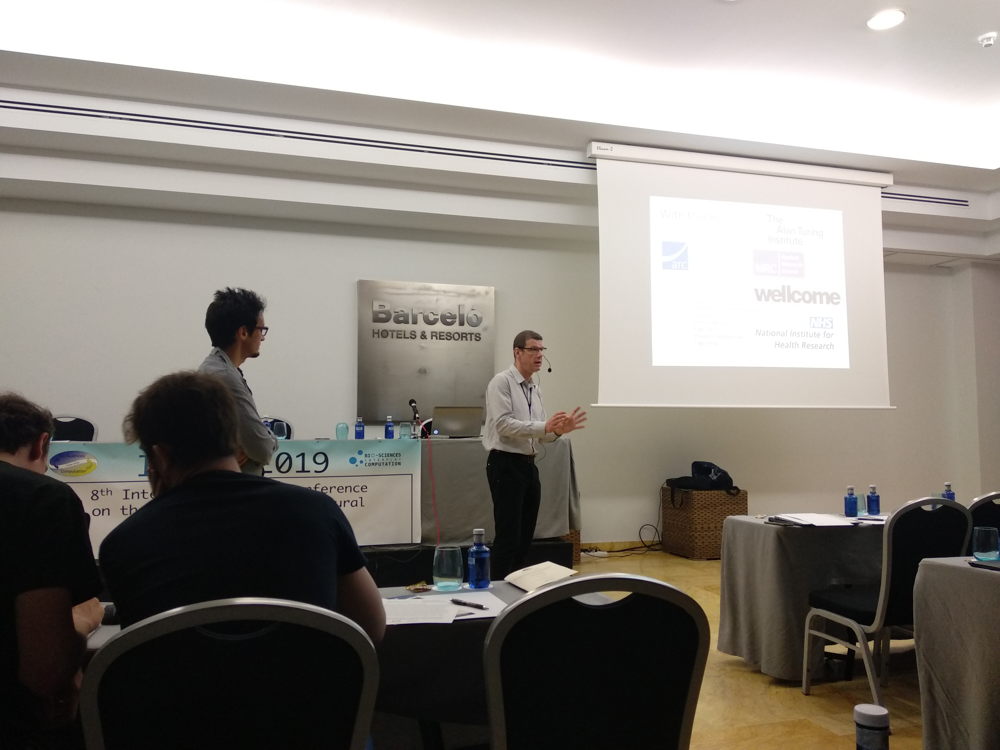
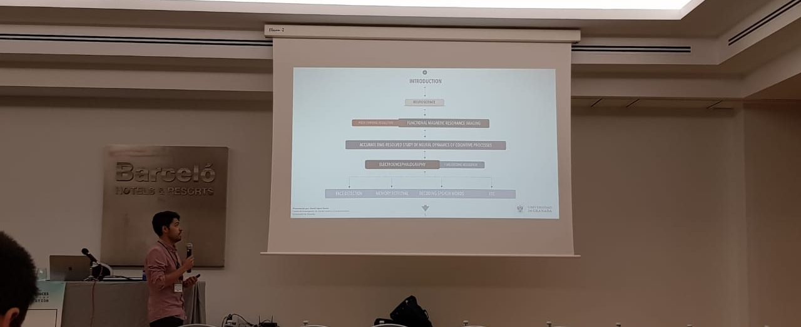
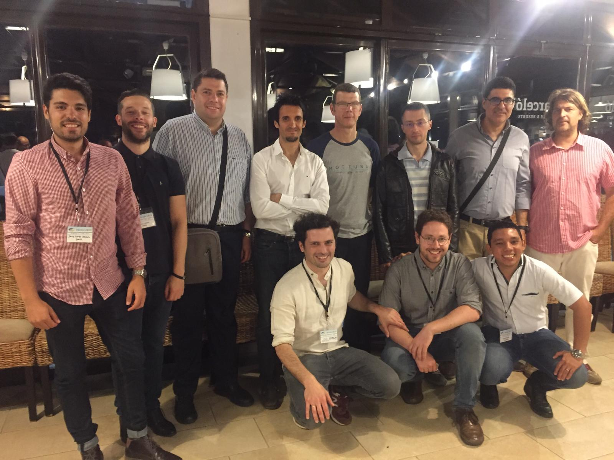

The SiPBA group and their collaborators have presented 5 works on the 8th [IWINAC](http://iwinac.org/iwinac2019/index.html) conference in Almeria (Spain), covering a variety of topics that include Parkinson's Disease and Developmental Dyslexia, FP-CIT imaging, EEG and pure machine learning with a work on the performance of SVM when used in imbalanced datasets. The proceedings will soon be available online, and this information updated.

And here is a bunch os photos of our intervention:

::: {layout-ncol=3}

 

 

 

](images/IMG_20190604_162103.jpg) 

 

](images/IMG-20190604-WA0023.jpg) 

 

 

:::