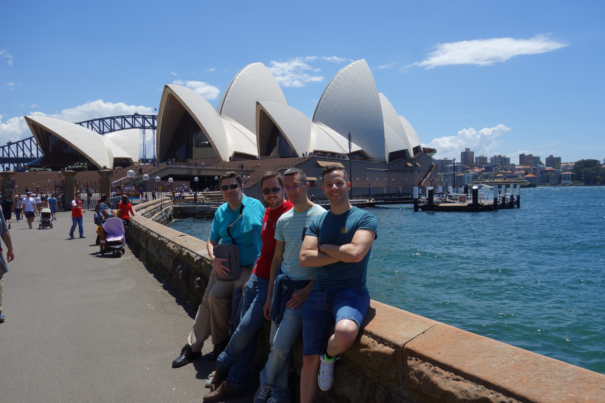
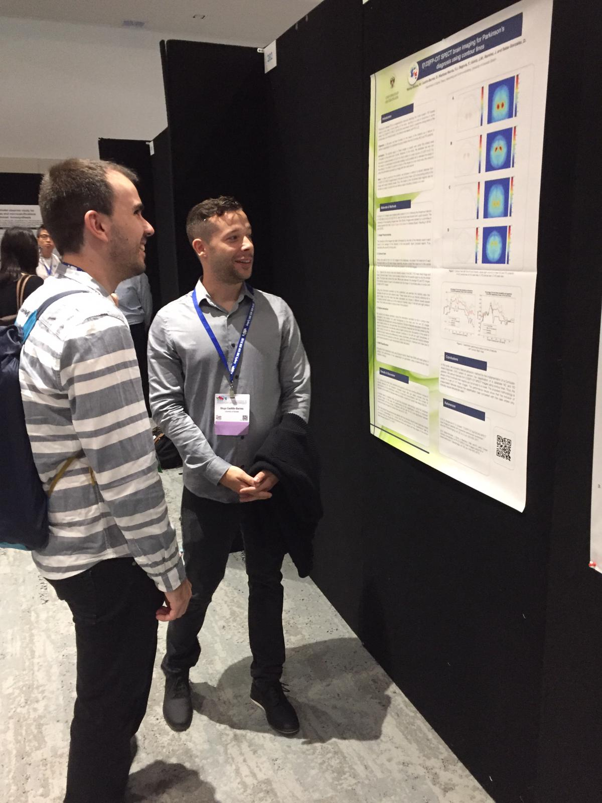
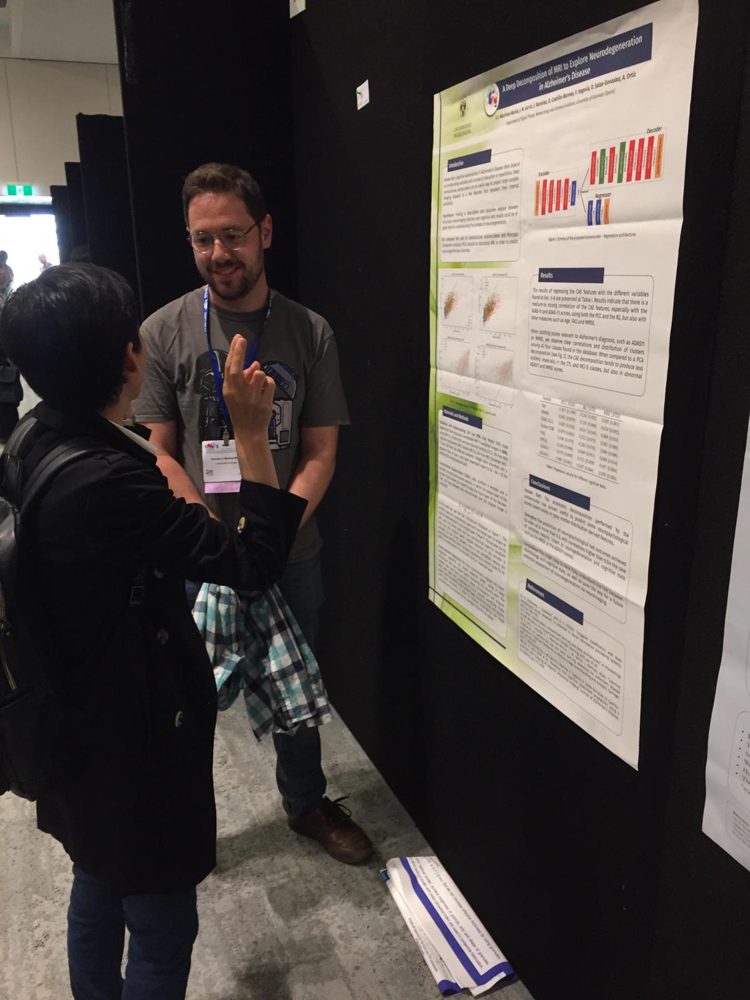
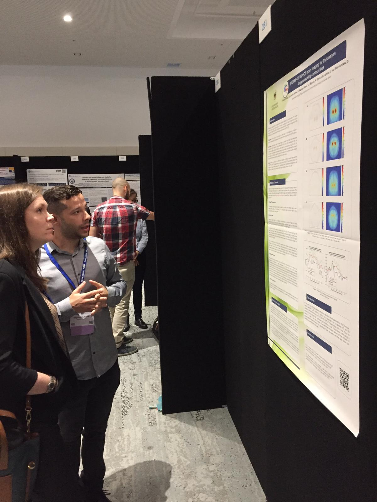
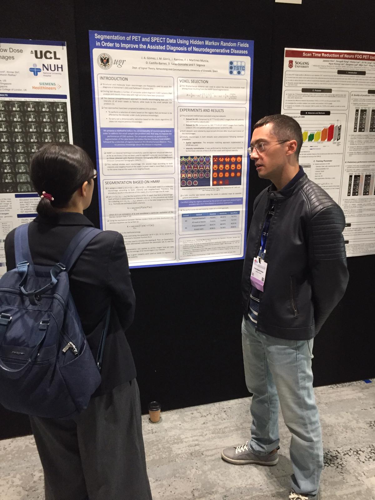
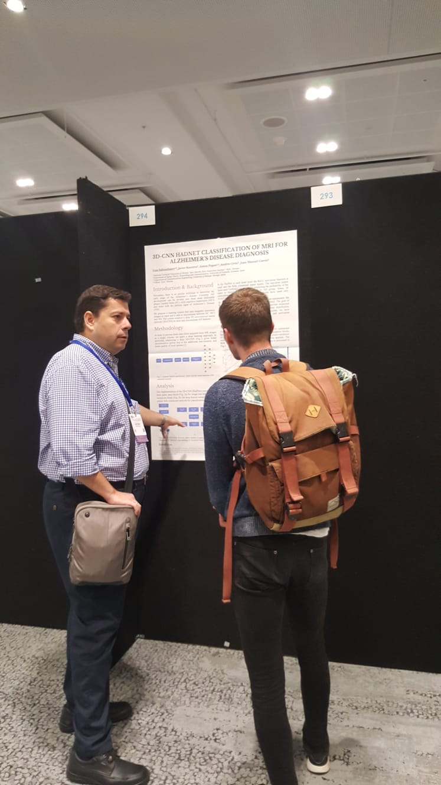
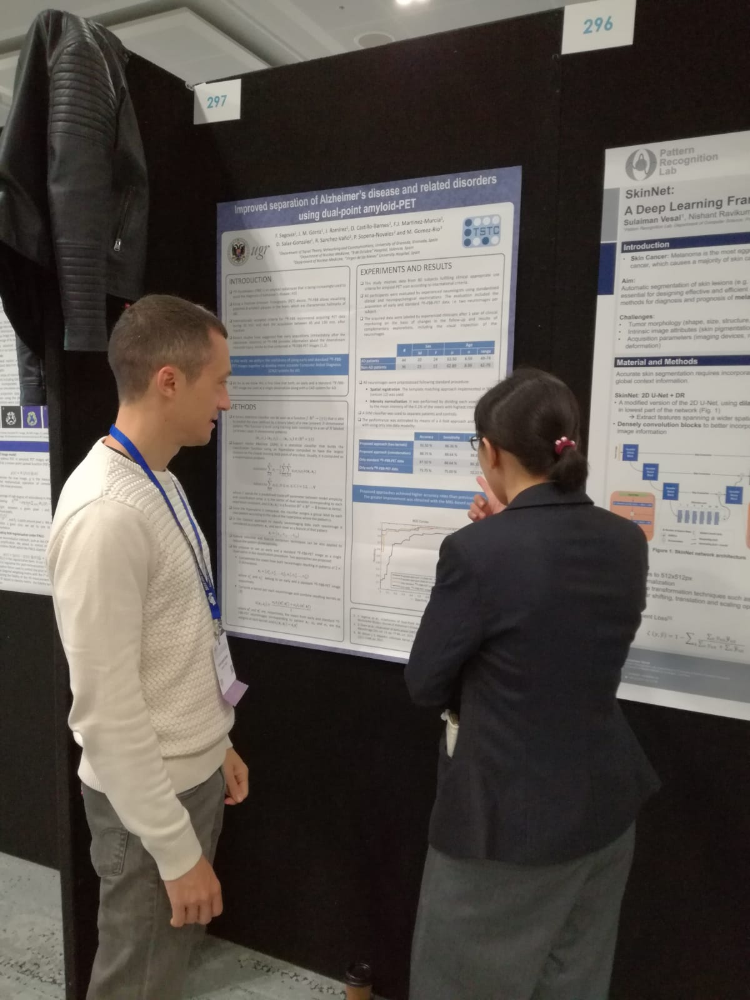
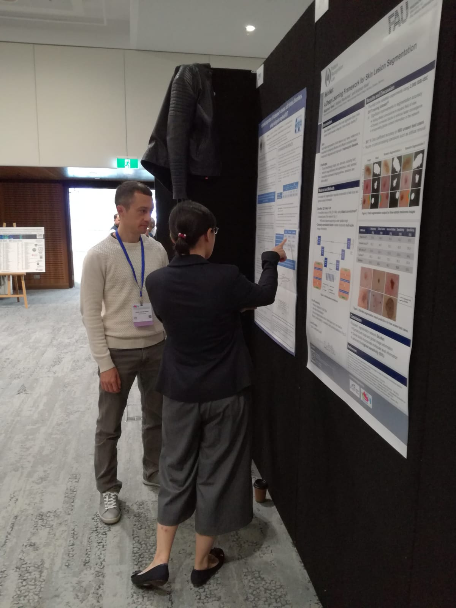

The SiPBA research group presented 7 works at the 2018 [IEEE Nuclear Science Symposium and Medical Imaging Conference in Sydney](http://www.nssmic.org/2018/), Australia. The topics covered Alzheimer's and Parkinson's Diseases, using a wide range of methodologies. Find here, ready to download, some of the posters that were presented at the conference:

- [Ensemble classification of heterogeneous biomarkers in the diagnosis of Parkinsonism](http://sipba.ugr.es/wp-content/uploads/2018/11/file2.pdf)
- [I\[123\]FP-CIT SPECT brain imaging for Parkinson’s diagnosis using contour lines](http://sipba.ugr.es/wp-content/uploads/2018/11/file3.pdf)
- [A Deep Decomposition of MRI to Explore Neurodegeneration in Alzheimer's Disease](http://sipba.ugr.es/wp-content/uploads/2018/11/Martinez-MurciaNSSMIC.pdf)
- [Improved separation of Alzheimer’s disease and related disorders using dual-point amyloid-PET](http://sipba.ugr.es/wp-content/uploads/2018/11/file5.pdf)
- [Segmentation of PET and SPECT Data Using Hidden Markov Random Fields in Order to Improve the Assisted Diagnosis of Neurodegenerative Diseases](http://sipba.ugr.es/wp-content/uploads/2018/11/file4.pdf)
- [Analysis of I\[123\]-Ioflupane SPECT intensity iso-surfaces to assist the diagnosis of Parkinsonism](http://sipba.ugr.es/wp-content/uploads/2018/11/file1.pdf)

And here is a bunch os photos of our intervention:

::: {layout-ncol=3}

 

 

 

 

 

 

 

:::