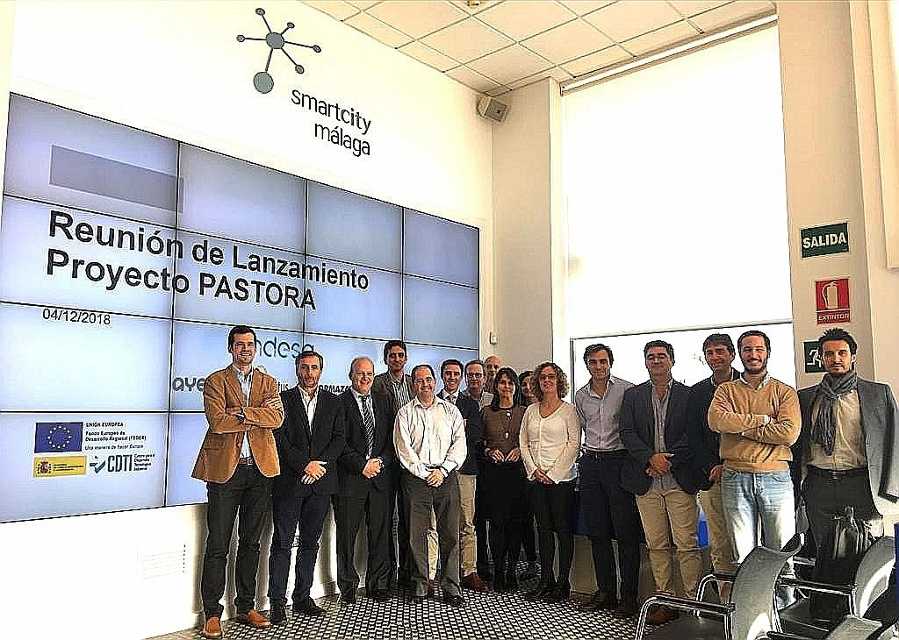

SiPBA is happy to share the following news ( from ENEL-ENDESA):

Today we are very excited in Smartcity Malaga Living Lab of Enel for hosting the official kick off of our new innovation project PASTORA: Preventive Analysis of Smart Grids with Real Time Operation and Renewable Assets Integration. This initiative is cofunded by European Regional Development Funds, with the funding support of the Centre for the Development of Industrial Technology (CDTI) of the Ministry of Economy and Competitiveness of Spain. The consortium of PASTORA, headed by Endesa, and formed by Ormazabal, AYESA, Ingelectus, AICIA-University of Sevilla and SiPBA-University of Granada, is now ready to face this ambitious new challenge for the next two years with the best energy!

