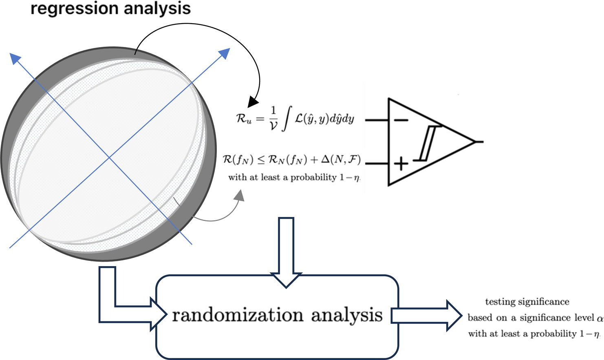
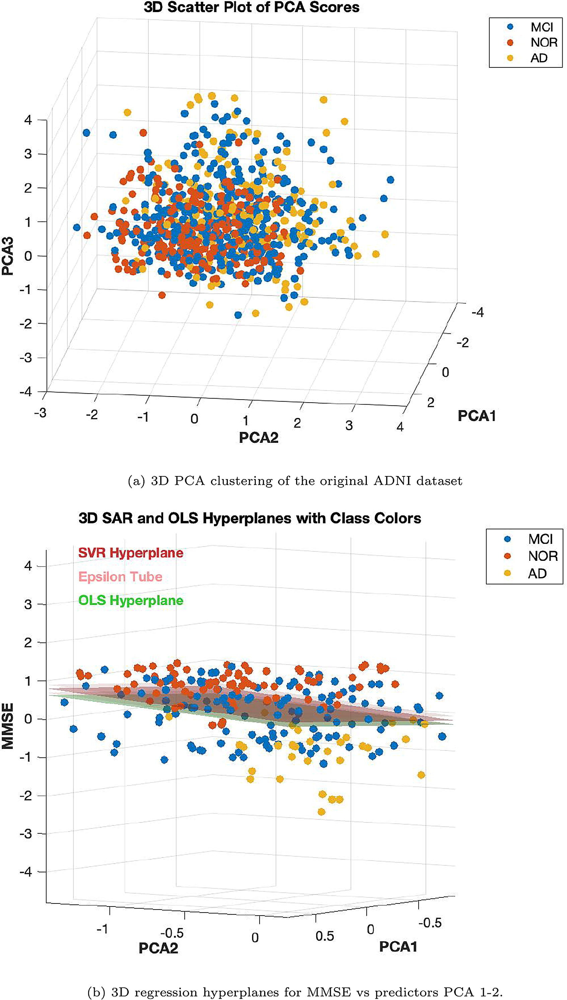

## 1. THE PROBLEM: IS CROSS-VALIDATION FAILING US?

Ordinary Least Squares (OLS) is the gold standard for linear regression due to its optimal statistical properties. On the other hand, modern Machine Learning (ML) techniques—such as Ridge, Lasso, and Support Vector Regression (SVR)—excel at minimizing expected loss and handling complexity. 

However, current AI approaches share a critical flaw: a **lack of rigorous statistical significance analysis**. Most ML researchers rely on empirical measures like $K$-fold cross-validation (CV) or permutations to evaluate their models. As highlighted in recent neuroimaging literature, utilizing CV on limited sample sizes can lead to massive variability and an **inflated false positive rate**, finding spurious correlations where none exist.

## 2. THE SOLUTION: STATISTICAL AGNOSTIC REGRESSION (SAR)

To bridge the gap between classical OLS statistics and advanced ML methods, this work introduces **Statistical Agnostic Regression (SAR)**.

SAR provides a formal, non-parametric statistical test for assessing the significance of ML regression models. Rooted in **Statistical Learning Theory (SLT)** and PAC-Bayesian theory, SAR establishes an upper bound on the actual risk (expected loss) of a linear support vector regressor under the worst-case scenario. 

By comparing this bounded actual risk to the expected loss under the null hypothesis $H_0$ (no linear relationship), SAR calculates a robust threshold. If the corrected risk falls below this threshold, $H_0$ is rejected, providing mathematical evidence of a true linear relationship with a probability of at least $1-\eta$.

::: {.p-5 .text-bg-dark .rounded-3}

### KEY ADVANTAGES OF SAR

*   **Agnostic & Non-Parametric:** Does not rely on rigid classical assumptions like Gaussianity or homoscedasticity.
*   **Controls False Positives:** Radically outperforms K-fold and Leave-One-Out (LOO) CV in controlling Type I errors in small sample sizes.
*   **Robust to Heteroscedasticity:** Through the Breusch-Pagan test, SAR residuals prove superior in detecting varying variance in data.
*   **Bridging the Gap:** Provides a perfect trade-off between the stability of OLS and the powerful fitting capabilities of ML methods.

:::

## 3. EXPERIMENTAL VALIDATION & NEUROIMAGING APPLICATIONS

The SAR framework was rigorously tested across three distinct scenarios:

1.  **Synthetic Gaussian & Non-Gaussian Data:** Evaluated against simulated datasets featuring scaling, rotation transforms, and forced heteroscedasticity.
2.  **Multivariate Cancer Dataset:** Real-world socio-economic predictors tested against cancer mortality rates.
3.  **The ADNI Dataset (Alzheimer's Disease):** Evaluating the correlation between cognitive decline (MMSE scores) and 3D structural MRI brain changes (Grey Matter) across Healthy Controls (NC), Mild Cognitive Impairment (MCI), and Alzheimer's (AD) patients.

::: {.column-screen-inset}
{#fig-graphical-abstract}
:::

### 3.1. RESULTS: THE ADNI DATASET

When applying standard ML cross-validation to the Healthy Control (NC) group—where no strong correlation between brain structure and cognitive decline should exist—ML models falsely reported significant correlations. This **overfitting** ruins the validity of the baseline when comparing against MCI and AD groups.

::: {.column-margin}
{#fig-adni-hyperplanes}
:::

**SAR corrected this anomaly.** By applying the SAR test, the false positive rates were suppressed, accurately confirming that no significant relationship existed in the healthy baseline. However, when evaluating the entire dataset (AD, MCI, NC), SAR successfully detected true linearity with a lower sample requirement, penalizing dimensionality appropriately.

::: {.p-5 .text-bg-primary .rounded-3}

## 4. CONCLUSIONS

The proposed **Statistical Agnostic Regression (SAR)** provides a much-needed formal foundation for hypothesis testing within Artificial Intelligence. 

- Standard ML validation methods (like K-fold CV) tend to overinflate false positives with small samples.
- SAR features effectively detect true linearity and seamlessly integrate into classical statistical frameworks (like the multivariate F-test).
- It acts as a safety net: informing researchers when there is *insufficient evidence* to establish a linear relationship, preventing the publication of non-replicable scientific results.

This methodology is poised to become a vital tool in medical research, neuroimaging, and any field where data scarcity and model reliability are critical.

:::