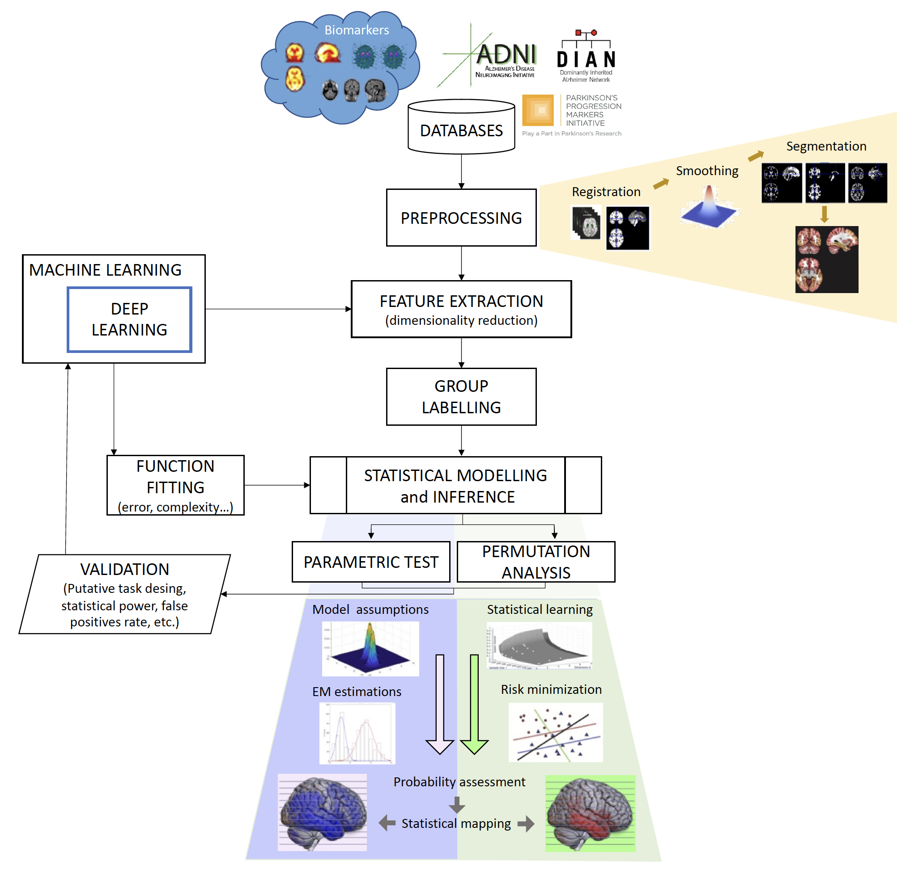

**VAL-DEEP-SCIENCE** is a proposal oriented to solve a particular problem: to formalise and validate the results obtained with machine learning (ML) and deep learning (DL) models in group analyses in neuroscience, using tools from Statistical Learning Theory (SLT) and modern statistics.

```{=html}
<!--[ Documentation](https://example.com){.btn .btn-outline-primary .btn role="button" data-toggle="tooltip" title="Read the documentation"}
[ Download](https://github.com/SiPBA){.btn .btn-primary .btn role="button" data-toggle="tooltip" title="Download the package"}-->
```
# The project

The possibilities for innovating meaningful metrics from biomedical data represent both opportunities and challenges. New analyses are expanding our view of the human brain, but the wide variety of approaches has led to inconsistencies in the literature. The reasons are multifactorial: heterogeneous datasets, multiple scanning sites and settings, differing acquisition protocols and processing methods, and diagnostic criteria. Even studies using putatively similar metrics and statistical tools can differ substantially from one another.

From the point of view of statistical learning theory, the root of this unsolved problem is the large ratio of the number of predictors (*d*) over the sample size (*N*), the so-called *d>>N* problem. It is particularly acute when translating neuroscience advances into clinical practice, where inferences are directly applicable to individual care through computer-aided diagnosis (CAD) tools.

Classical statistical inference is limited by its use of *p*-values, and issues such as inflated type I error rates, *p*-hacking or poor experimental designs have affected reproducibility and replicability. This project builds on the **concept of prevalence** and proposes a **novel framework using SLT** for estimating statistical significance through both univariate and multivariate tests. Instead of the probability of observing the data given no effect, it estimates the likelihood that the effect is present, evaluating the *worst-case scenario* of the classification error through concentration inequalities and data-dependent generalisation bounds. With limited sample sizes, this approach is hypothesised to be more conservative and effective than Bayesian methods, without requiring computationally demanding parameter estimation.

The proposed algorithms will be applied to group analyses such as Alzheimer's disease (AD) vs. control or Autism Spectrum Condition (ASC) vs. neurotypical, with three goals: (i) formalise the use of ML by means of SLT, (ii) reduce the high variability of the outcomes provided by ML researchers in this field, and (iii) implement robust software tools based on modern statistics for diagnostics. VAL-DEEP-SCIENCE continues the work of our previous national project (Deep-Neuromaps).

![General framework: biomarker datasets are harmonised, pre-processed and analysed (statistical inference for group comparison), and validated under several putative task designs.]



# Objectives

VAL-DEEP-SCIENCE has one **general objective: to formalise algorithms proposed in ML, including DL architectures, in order to develop a robust tool for statistical inference in neuroscience**. This is organised in the following **specific objectives**.

**At the theoretical level (models + validation):**

1.  **Formalise the use of ML models in classical statistical inference** (hypothesis testing and Bayesian inference) in neuroscience, assessing multiple classification/regression tasks in hierarchical observation models within the framework of SLT.
2.  **Derive and validate complex ML classifiers (DL)** by means of (i) univariate inference approaches based on *p*-tests combined with classical techniques for the multiple comparison problem, and (ii) multivariate inference approaches based on feature extraction and selection (FES), avoiding *ad-hoc* and conservative corrections such as Bonferroni or Random Field Theory.

**At the application level (neurological diseases and conditions):**

1.  **Design and validate efficient DL algorithms** with discriminative and predictive power on the Vallecas Dataset and other international initiatives (ADNI, DIAN, PPMI, ABIDE), based on variables easy to obtain in any clinical setting, able to detect and predict cognitive decline, AD and other non-neurotypical patterns.
2.  **Characterise the structural/functional pattern of ASC stratified by sex, age and other groups**, using our own large mixed-site (f)MRI datasets in autism and ensemble DL architectures for statistical inference.
3.  **Demonstrate, using a rigorous statistical framework, that DL methods** evaluated on biomarker datasets are more efficient at extracting relevant patterns of neurological diseases/conditions through complex classifiers.
4.  **Implement the devised processing pipelines in a high-level general-purpose language** (e.g. Python) as reliable diagnostic tools that produce reproducible and replicable outcomes.

# Results
The project is already running. The current status is:

## Publications:
-   A novel framework to evaluate regression performance, called Statistical Agnostic Regression (SAR) by @gorriz2024statistical.
-   We published a paper in the *International Journal of Neural Systems* about a [cross-modality latent variable framework using joint Variational Autoencoders](/publications/2024-05-10-bridging/index.qmd), by @martinez-murcia2024.
-   We presented a series of publications at the *International Work-Conference on the Interplay Between Artificial and Natural Computation* (IWINAC 2024):
    -   *A Cross-Modality Latent Representation for the Prediction of Clinical Symptomatology in Parkinson’s Disease* by @vázquez-garcía2024
    -  

## Talks
-   IWINAC 2024: [Cross-Modality Latent Variable Framework for the Prediction of Clinical Symptomatology in Parkinson’s Disease]
-   IWINAC 2024: [PDBIGDATA: A New Database for Parkinsonism Research Focused on Large Models]


## Software
-   We released the [SAR](https://github.com/SiPBA/sar) library, a Statistical Agnostic Regression Library that provides tools for statistical analysis, regression modeling, sample size analysis, and visualization. It includes OLS and SAR models, as well as utilities for data preprocessing and plotting.

# Team

The project is led by the **SiPBA** (Signal Processing and Biomedical Applications) group at the Data Science and Computational Intelligence (DaSCI) Research Institute, University of Granada (UGR). The full-time team includes J.M. Górriz, J. Ramírez, D. Salas-González, I. Álvarez-Illán, F. Segovia, C. García-Puntonet, C. Jimenez-Mesa, A. Zorrilla with a Alejandro Hernandez and David Lopez.

Collaborators:

-   Neuroscience in Psychiatry group, **University of Cambridge** (UCAM), coordinated by J. Suckling (imaging datasets and research collaboration).
-   **Ludwig-Maximilians-Universität München**, led by J. Levin (imaging datasets).
-   **University of Leicester**, Y. Zhang and S.-H. Wang's group (methods).
-   FCIEN and Neurocenter clinic, and international initiatives (DIAN, ADNI, PPMI, ABIDE).

# Funding
This project is funded by MICIU/AEI/10.13039/501100011033 and by ERDF/EU (European Regional Development Fund). <!-- TODO: confirmar el texto de financiación y el código de proyecto -->


