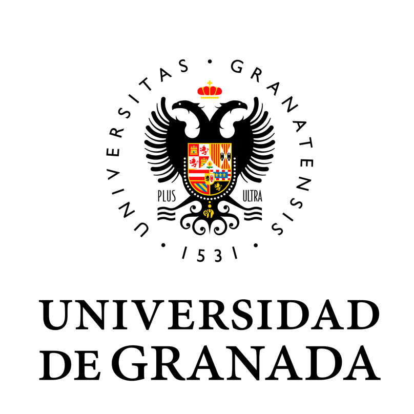
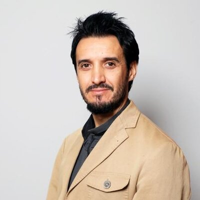
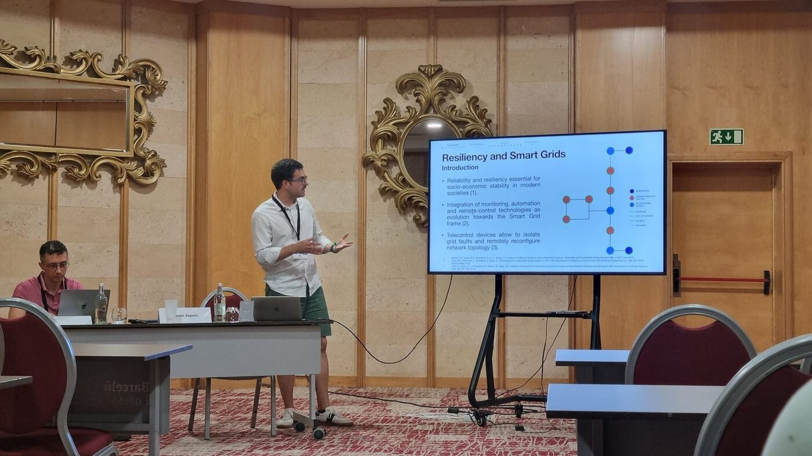

## About the Chair

The Endesa-UGR Chair in Artificial Intelligence is a collaboration framework between [Endesa](https://www.endesa.com) (through its distribution company e-distribución) and the [University of Granada](https://www.ugr.es). It consolidates more than eight years of joint research between both institutions, previously channelled through the SiPBA Research Lab and the Andalusian Inter-University Institute in Data Science and Computational Intelligence ([DaSCI](https://dasci.es)).

Within the Chair, the SiPBA Research Lab develops algorithms and systems based on Artificial Intelligence to support the resilience and efficient operation of the electric power grid.

## Objectives

The Chair is structured around four lines of action, which are also the headings of its annual budget:

- **Research.** Develop AI methods applied to the electric distribution network, currently along two lines: thermal monitoring of grid assets and optimization of the maintenance of remote-control devices (*telemandos*).
- **Knowledge transfer.** Bring the results to the operation of the distribution network, validating them on real data and pilots deployed in collaboration with e-distribución. The guiding question is how AI effectively changes the way an electricity distribution company operates.
- **Training and talent.** Lectures by Endesa and UGR staff in UGR master's programmes, and annual awards for the best Bachelor's thesis (TFG), Master's thesis (TFM) and PhD thesis.
- **Dissemination.** Seminars, conferences, outreach material and visibility of the results, including the organization of sessions at international conferences such as IWINAC-ICINAC.

## Organization

### Direction

<a href="../../people/Juanma_Gorriz/index.html">Juan Manuel Górriz Sáez</a>
Director
Full Professor, Universidad de Granada

Ignacio Berenguer García
Deputy Director
Chair Coordinator, e-distribución (Endesa)

### Members

Universidad de Granada

Enrique Herrera Viedma
Vice-Rector for Research and Transfer
Universidad de Granada

<a href="../../people/fermin-segovia/index.html">Fermín Segovia Román</a>
Associate Professor
Dept. of Signal Theory, Telematics and Communications

<a href="../../people/ignacio-alvarez-illan/index.html">Ignacio Álvarez Illán</a>
Associate Professor
Dept. of Signal Theory, Telematics and Communications

Endesa

M

Mario Fernández Jiménez
Director of Strategic Projects &amp; Business Improvement
e-distribución

E

Emilio Jiménez Criado
Director, Andalusia and Extremadura Territorial Area
e-distribución

Rafael Sánchez Durán
Director, Andalusia and Extremadura
Endesa

The Joint Monitoring Committee (*Comisión Mixta de Seguimiento*), made up of representatives of both institutions, approves the annual activity plan and budget and reviews the report of activities and the budget execution of the previous year. The research activities of the Chair are carried out by the SiPBA Research Lab, including [Álvaro Zorrilla Carriquí](../../people/alvaro-zorrilla-carriqui/index.qmd).

## Activities

:::{#chair-activities}
:::

## 2026 highlights

- **IWINAC-ICINAC 2026 (Fuerteventura, 26–29 May).** The Chair organized the special session *SHIFT: Social and Civil Engineering through Human AI Translations*, where the work on telemando repair prioritization was presented. See the [press release in Canal UGR](https://canal.ugr.es/noticia/la-catedra-endesa-ugr-participa-en-el-congreso-iwinac-icinac-donde-aporta-conocimiento-y-soluciones-para-la-fiabilidad-y-seguridad-de-la-infraestructura-electrica/).
- **Publications.** One journal article in *Integrated Computer-Aided Engineering* on thermal monitoring of power transformers, and one conference paper in Springer LNCS on telemando repair prioritization (details in each activity page).
- **Pilot deployments in Granada.** Thermal camera installed in an urban distribution center on 24 July 2026, and a digital twin of the medium-voltage network of Granada for telemando prioritization.
- **Outreach videos.** Two explanatory videos, one per research line, prepared in September 2026.
- **Premios Nacionales de Innovación Urbana Ciudad de Granada 2026.** Joint candidacy of ATISoluciones, Endesa (e-distribución) and the University of Granada, submitted on 14 September 2026 in the category "Innovación en Gestión Energética Urbana".

{fig-alt="Speaker presenting at the SHIFT special session"}
