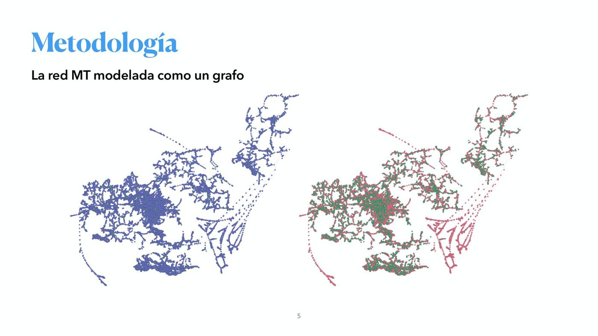
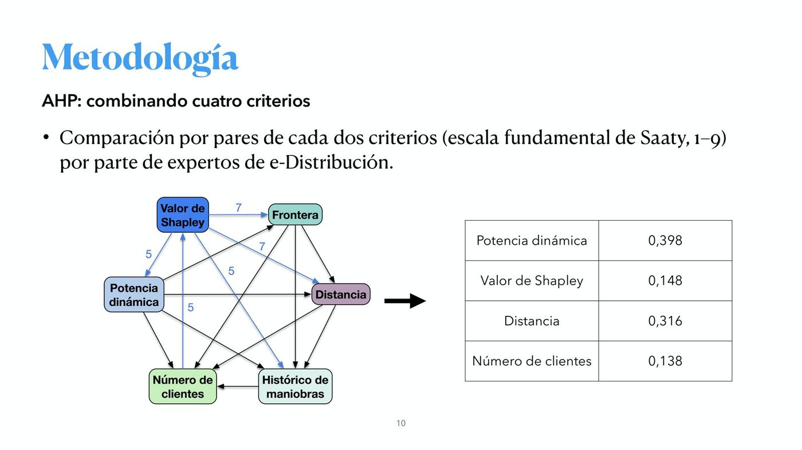
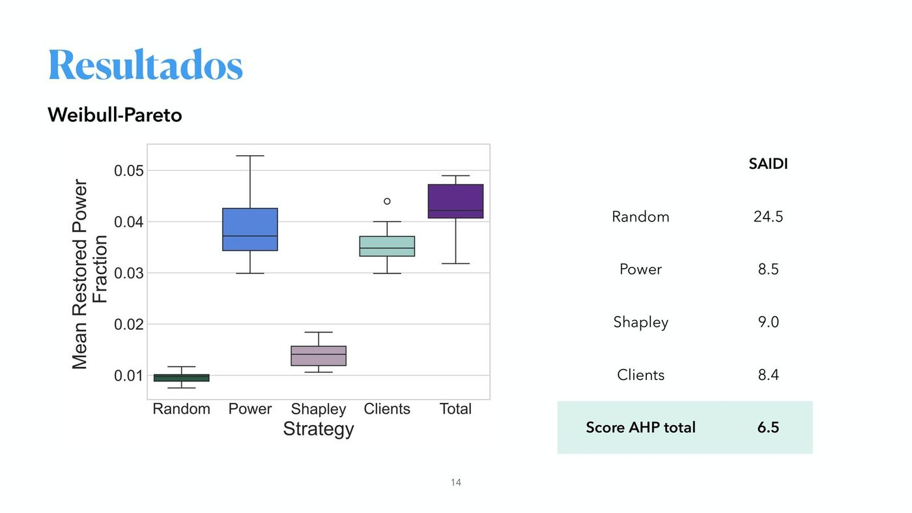
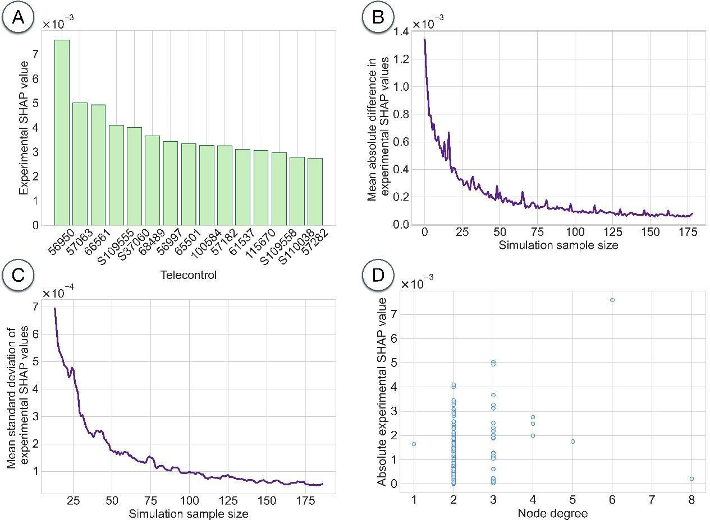

## Context

Telemandos are remote-control devices that allow the distribution company to supervise and operate the medium-voltage (MT) network from a distance, for instance to restore supply to a section after a fault. When telemandos fail, the order in which they are repaired determines how much power is left without remote support and for how long.

## Goal

Decide **which telemandos to repair first** so that, with the same repair resources, the time customers spend without telemando support is minimized. In 2026 the activity moved from a preliminary model, based only on the installed power left without support, to a complete multi-criteria prioritization methodology validated by simulation on the real MT network of Granada.

## Approach

### Digital twin of the network

The network is modelled as an undirected graph (implemented with NetworkX) whose vertices are substations, transformation centers and telemandos, and whose edges are the line sections that connect them. The digital twin of the MT network of Granada contains **24,900 nodes, 25,463 line sections, 1,487 telemandos, 9,339 transformation centers and 50 substations**. Priorities are recalculated dynamically after each failure, because the impact of a device depends on the instantaneous topology of the remaining network.

{fig-alt="Graph representation of the medium-voltage network of Granada"}

### Importance criteria

The final importance score is a linear combination of four criteria, whose weights were obtained with the Analytic Hierarchy Process (AHP) from pairwise comparisons (Saaty 1–9 scale) made by e-distribución experts:

| Criterion | Description | AHP weight |
|---|---|---|
| Dynamic linked power | Power left without control given the current state of the network | 0.398 |
| Distance to the operational unit | Response time of the repair crew | 0.316 |
| Shapley value | Static topological importance of the telemando | 0.148 |
| Number of customers | Social impact of the failure | 0.138 |

The **Shapley value** treats the network as a cooperative game in which each telemando is a player. Its exact computation is generally intractable, but the topological particularities of power networks made it possible to derive a computable expression. **Boundary telemandos** receive special attention, since losing them means losing the ability to restore the corresponding section.

{fig-alt="Slide describing the AHP combination of four criteria"}

### Data quality and acquisition

The network graph was first built from KMZ files, where mis-named sections and overlapping lines were found. The UGR developed an automatic procedure to detect mis-named sections and reported the cases found in the province of Almería. Following a pilot extraction for the Guadix and Aldeire substations (July 2026), tabular extractions of network connectivity, installed power and number of customers proved better suited than the KMZ files. On 1 September 2026 e-distribución delivered the extraction for the whole Andalusia and Extremadura area, and the algorithm is being adapted to build the graph from these tables.

## Results

The methodology was validated in three failure scenarios: (1) fixed failure and repair probabilities estimated from historical data; (2) a Weibull-Pareto model of weekly failures and repairs; and (3) the simultaneous failure of all the telemandos of an operational unit, repaired one by one. Restored power and the SAIDI index were measured for each repair strategy:

| Repair strategy | SAIDI (fixed probabilities) | SAIDI (Weibull-Pareto) |
|---|---|---|
| Random | 0.80 | 24.5 |
| Linked power | 0.48 | 8.5 |
| Shapley value | 0.51 | 9.0 |
| Proximity | 0.60 | — |
| Number of customers | 0.47 | 8.4 |
| **Total AHP score** | **0.47** | **6.5** |

{fig-alt="Boxplot of restored power fraction by repair strategy"}

Main conclusions:

- All criticality-based strategies clearly outperform random repair: the **order of repairs matters**, not only the repair capacity.
- The combined AHP criterion is among the most effective in all simulations and metrics, and is the only one that explicitly integrates response time and social impact.
- With the same resources and only changing the repair order, the algorithm reduces by **40% to 70%** the time customers spend without telemando support in simulation.

### Next steps

- Integration of the tool into e-distribución systems and extension to the whole Andalusia and Extremadura area.
- Inclusion of external telemando reliability data.
- Extension of the IWINAC-ICINAC 2026 paper to a Q1 journal article.
- New activity: minimum number and optimal location of telemandos to maximize control of the MT network.

## Publication

**Prioritizing Telecontrol Repairs in Electrical Distribution Networks Using Graph-Based Impact Analysis.** Á. Zorrilla, F. Segovia, J. Ramírez, I. J. Aguilera, A. M. Vargas, J. Bello and J. M. Górriz. *IWINAC-ICINAC 2026*, Fuerteventura (Spain). LNCS 16575, pp. 359–368, Springer (2026). [DOI](https://doi.org/10.1007/978-3-032-27317-8)

The paper uses data of the province of Granada provided by e-Distribución Redes Digitales. It shows that only a small subset of telemandos, located at structurally critical points, is responsible for the largest load interruptions, and that simple structural metrics such as node degree are not enough to determine operational criticality.

{fig-alt="Panels showing SHAP-like importance values of telemandos"}

## Dissemination

- Presentation at the SHIFT special session of IWINAC-ICINAC 2026 (27 May 2026) and [press release in Canal UGR](https://canal.ugr.es/noticia/la-catedra-endesa-ugr-participa-en-el-congreso-iwinac-icinac-donde-aporta-conocimiento-y-soluciones-para-la-fiabilidad-y-seguridad-de-la-infraestructura-electrica/).
- Explanatory video *Prioritization of telemando repairs in distribution networks: concept, design and test on the MT network of Granada* (September 2026).

## Team

SiPBA Research Lab: Álvaro Zorrilla, Fermín Segovia, Javier Ramírez and Juan Manuel Górriz, in collaboration with Isidro J. Aguilera, Antonio M. Vargas and José Bello (e-Distribución Redes Digitales).

Part of the [Endesa-UGR Chair in Artificial Intelligence](index.qmd).
