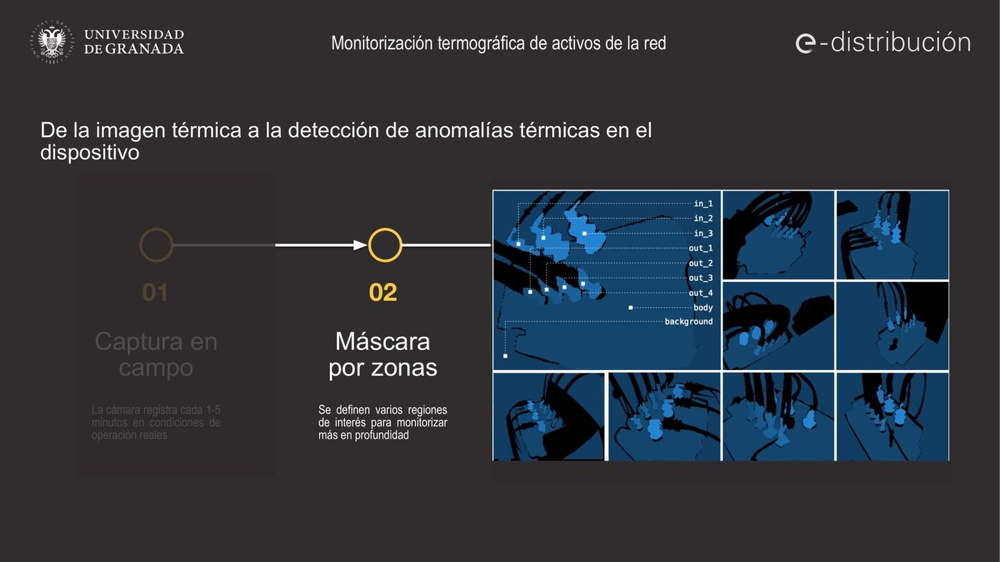
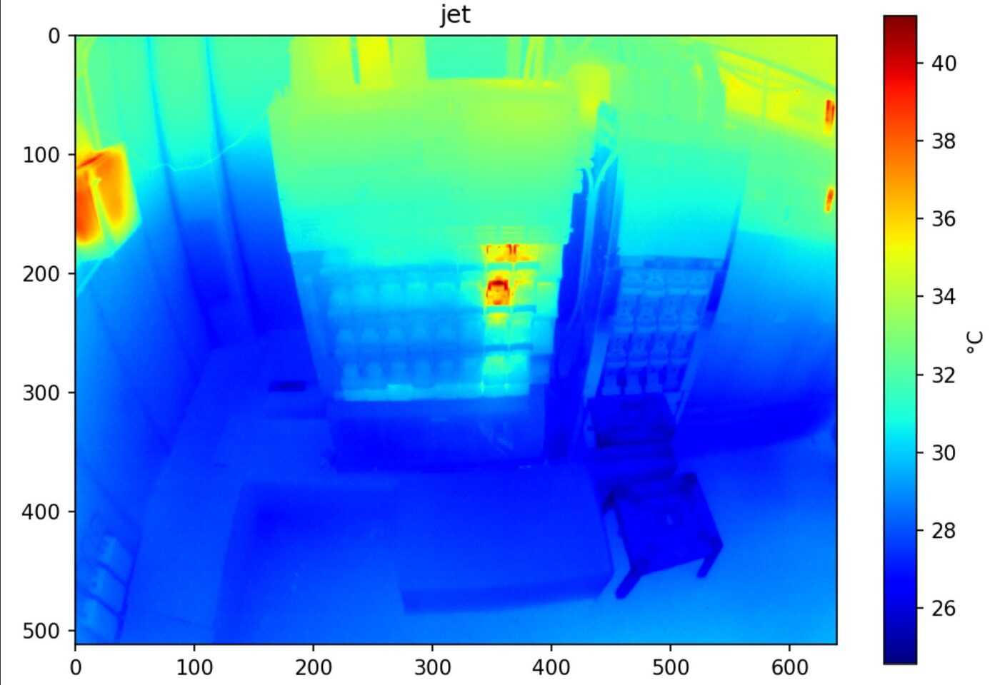
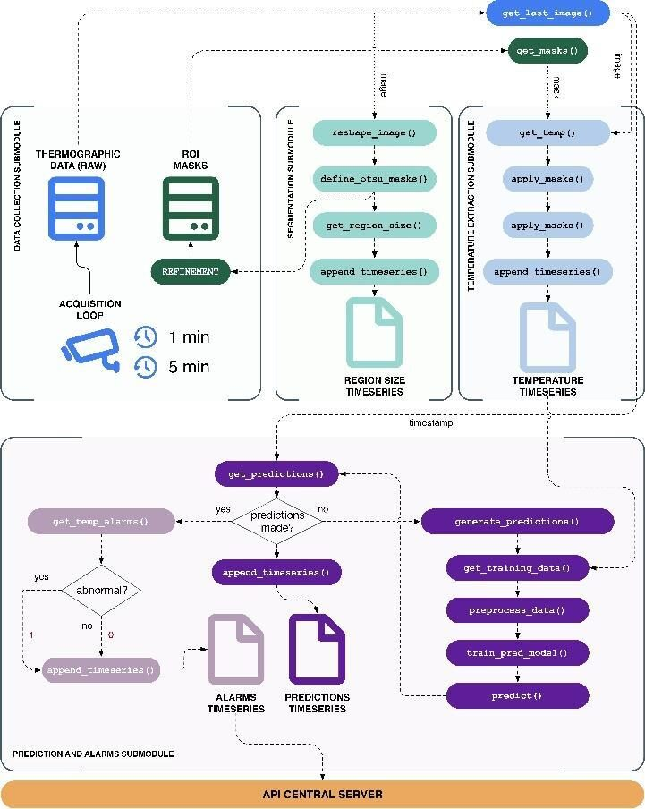
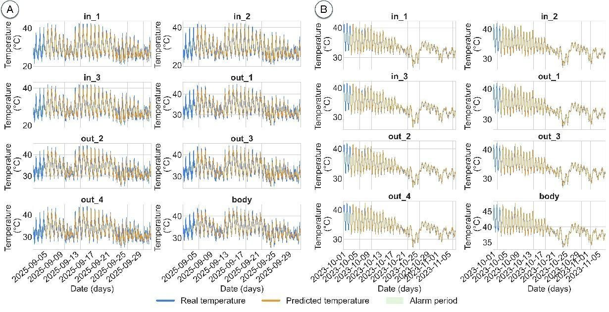
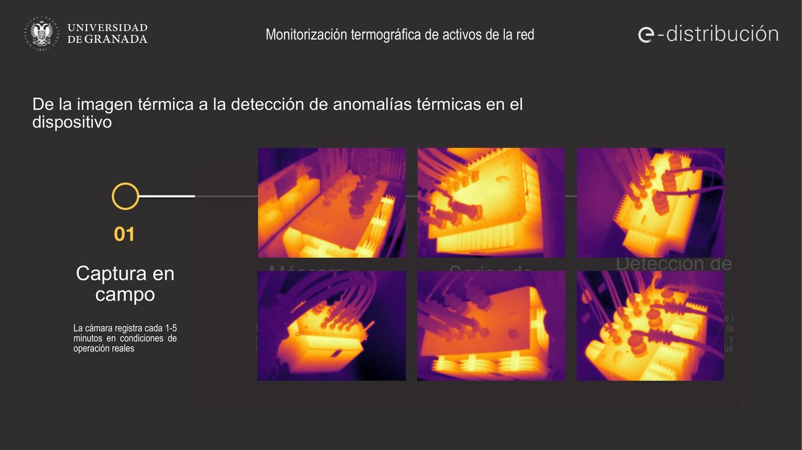

## Context

Overheating is one of the main precursors of failure in electric grid assets such as transformers or low-voltage panels. Continuous thermal monitoring makes it possible to act before a fault causes an outage. This activity ("Thermography of electrical panels") applies the AI-based thermal monitoring architecture developed in the RESISTO project, deployed in the Doñana National Park with Endesa, to urban distribution centers.

## Goal

Detect abnormal thermal behavior of grid assets early and automatically, and relate temperature variations with the load, to support maintenance decisions and network resilience.

## Approach

The system captures a thermographic image every 1–5 minutes, with timestamp and associated ambient temperature, and sends it to a server. On each image, regions of interest are defined for the critical components of the panel, which generate individual temperature series. An adaptive autoregressive model, validated in RESISTO, learns the normal behavior of each zone and flags deviations that deserve inspection.

{fig-alt="Slide showing zone masks on thermal images"}

## Urban pilot in Granada (2026)

In 2026 the activity moved from the design phase to the deployment of a pilot in an urban distribution center in Granada, monitoring a low-voltage panel (Altamira panel) and two transformers.

- **23 February and 4 March:** follow-up meetings with e-distribución, in which the UGR defined the thermographic camera model required.
- **17 March:** e-distribución orders the camera following the UGR recommendations.
- **8 May:** distribution center CD 92726 (Zona Norte, Granada) is proposed as the site. ATISoluciones provides the SIM card and 4G router, and configures the camera.
- **July:** mounting support defined (bullet-type camera, UTP connection and PoE power).
- **24 July:** camera installed. The UGR verifies the connection and the reception of the first thermal images.
- **July–September:** first possible hot spots detected. The team responsible for the Altamira data and the LV Control Center of e-distribución join the project to contrast the thermographs with the electrical data.

{fig-alt="Thermal image of a low-voltage panel"}

**Next phase:** fuse the thermal information with the available electrical measurements (Altamira data) to relate temperature variations with load.

## Publication

**AI-Based Novelty Detection for Real-Time Thermal Monitoring of Power Transformers.** Á. Zorrilla, D. López-García, F. Segovia, J. Rodríguez-Rivero, J. Ramírez, F. J. Martínez-Murcia, R. Serrano and J. M. Górriz. *Integrated Computer-Aided Engineering*, 33(3), 279–300 (2026). DOI: [10.1177/10692509261446164](https://doi.org/10.1177/10692509261446164)

The paper describes a decentralized edge-computing architecture for real-time detection of thermal anomalies in transformers, based on 20 thermographic cameras managed by nine industrial computers in Doñana National Park (RESISTO project, with Endesa). Segmentation algorithms (Otsu, MSER) analyze nine regions of interest per transformer, and an adaptive autoregressive model calibrated on the last four days of data predicts temperature, with model order and prediction window selected via the Akaike Information Criterion. Alerts are driven by a rectified non-linear metric that quantifies significant deviations between measured and predicted temperature.

- On a synthetic dataset based on thermodynamic principles and AEMET weather records, the algorithm detected all 265 scheduled anomaly events with an RMSE below 2.65%.
- On operational transformers, the RMSE stayed below 5.32%.
- The model adapts to different acquisition rates (e.g. optimal order changing from p = 50 to p = 250 when moving to one image per minute) without loss of accuracy.
- Processing at the edge drastically reduces the need to transmit video streams to central servers.

{fig-alt="Diagram of the edge-computing monitoring architecture"}

{fig-alt="Time series of real and predicted temperature"}

## Dissemination

- Explanatory video *Thermographic monitoring of grid assets* (September 2026), showing the camera deployed in Granada and the full process from field capture to anomaly detection.
- **Premios Nacionales de Innovación Urbana Ciudad de Granada 2026 (GRX-AI).** Joint candidacy of ATISoluciones, Endesa (e-distribución) and the University of Granada, submitted on 14 September 2026 in the category "Innovación en Gestión Energética Urbana", entitled *Granada — RESISTO and GridWatch: integration of artificial intelligence for the supervision of electric grids in urban environments and natural areas*. It combines the RESISTO deployments in Doñana with the urban pilots of the Chair in Granada (ETSI de Caminos, Canales y Puertos, and the Zona Norte center). SiPBA is cited as the scientific reference in image processing, prediction and AI.

{fig-alt="Thermal images of transformers"}

## Team

SiPBA Research Lab: Álvaro Zorrilla, Fermín Segovia, Javier Ramírez and Juan Manuel Górriz, among others (see the publication authors), in collaboration with e-distribución, ATISoluciones and the LV Control Center.

Part of the [Endesa-UGR Chair in Artificial Intelligence](index.qmd).
